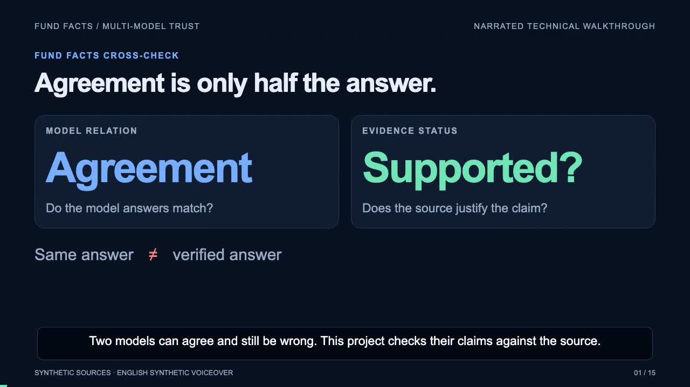

# Five-minute video demo

[**▶ Watch / download the video (MP4)**](https://github.com/whitesungun876/fund-facts-cross-check/raw/refs/heads/main/demo/fund-facts-demo.mp4)

5:00 · 1280 × 720 · English synthetic narration · Synchronized English captions.

The video follows the synthetic source documents through two actual model responses, strict validation, scope alignment, value normalization and citation checks. It then demonstrates a separately labeled injected shared mistake, earlier development failures and the regression gates. The animation explains saved CLI results; it is not a screen recording or a product UI.

Only the video is required for the demo. The runtime code and evaluation remain in the repository.
