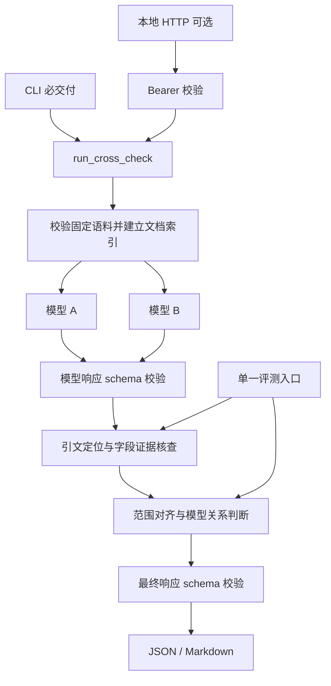

# Fund Facts Cross-Check — 技术规格说明书

> 实施说明：此文件保留原始设计。当前冻结范围和接口以 [contract.md](contract.md) 为准；实现包含五个运行模块、一个评测入口和一个单元测试文件。HTTP/Bearer 扩展暂缓。当前验证结果见 [README.md](README.md)，原始设计中的 live 验收不表示已经完成。

| 项目 | 内容 |
| --- | --- |
| 文档版本 | 1.0 |
| 日期 | 2026-09-15 |
| 状态 | 已实现；43 个单元测试、27 个离线样本、两项 mutation gate 与一次真实双模型运行通过 |
| 对应作业 | A2B2 Part 4 — Multi-model trust / orchestration |
| 实施约束 | 总开发时间最多 6 小时；最多 8 个源文件；一个评测入口；10 分钟 README；5 分钟演示；AI-use disclosure |
| 主要交付 | 本地 CLI、JSON/Markdown 结果、虚构资料、离线与真实调用评测 |
| 可选交付 | 复用同一业务函数的本地 HTTP API；不作为核心作业完成的前提 |

本文中的“必须”是验收要求，“建议”是可调整的实现选择。所有示例基金、费率和输出均为设计示例，不是真实基金资料或已经完成的模型运行。

## 1. 目标与边界

### 1.1 用户任务

默认问题：

> 比较这两只基金的年度管理费和本金保证声明。每项结论附上原文依据，资料没有说明的部分标为未知。

两个不同模型独立阅读同一问题和相同文档。程序验证模型输出的结构、定位引用、核查有限字段的证据，并按适用范围比较结果。

必须独立表达三个维度：

1. **运行与完整性**：模型是否成功返回、预期字段是否齐全。
2. **模型关系**：一致、分歧、缺失、范围不同或未知。
3. **证据状态**：支持、矛盾、证据不足或无法核查。

两个模型一致不能自动获得证据支持；原文中存在引用不能自动证明引用支持结论。

### 1.2 MVP 支持范围

- 固定的两份英文、明确标注为虚构的 Markdown factsheet。
- 字段仅为 `annual_management_fee` 与 `capital_guarantee`。
- 每份文档只描述一个基金、一个份额类别、一组生效条款。
- 百分比和基点转换；明确、无条件的本金保证或不保证声明。
- 同一语料内所有文档直接进入上下文，无检索阶段。
- 两个不同模型 ID；模型不交换首次回答；无第三个裁判模型。
- 输出 JSON，以及从已校验 JSON 渲染的 Markdown 表格。

### 1.3 不在本次交付范围内

任意 PDF/OCR、网页搜索、真实金融资料上传、复杂费率条件、开放式风险摘要、基金推荐、交易接口、前端、向量数据库、账户系统、云部署。年度管理费不能被描述为总费用或实际扣费金额。

系统只核查所给资料中的声明，不认证资料本身或真实基金状况。复杂语义返回不可核查，不猜测答案。

## 2. 技术栈与依赖

| 层 | 选型 | 用途与约束 |
| --- | --- | --- |
| 语言 | Python 3.12 | `asyncio` 并发与总时限；`Decimal` 精确换算 |
| 依赖管理 | uv、`pyproject.toml`、`uv.lock` | 实现时解析兼容版本并提交锁文件；不声称已验证当前组合 |
| 数据校验 | Pydantic 2.x | 请求、模型响应、最终输出统一模型；拒绝额外字段 |
| 外部请求 | HTTPX `AsyncClient` | 调用模型网关；显式连接/读取超时 |
| 模型入口 | OpenRouter Chat Completions | 同一适配器调用两个不同模型；模型 ID 从环境变量读取 |
| 结构化生成 | 网关支持的 `json_schema` 响应格式 | 选择支持结构化输出的模型；本地 Pydantic 校验始终保留 |
| CLI | 标准库 `argparse` | 减少依赖；运行、输出路径、评测模式 |
| 评测 | 单个 `evaluate.py` + JSON 样本 | 断言实际业务函数；聚合分类指标；离线不访问网络 |
| 日志 | 标准库 `logging` + JSON 编码 | 请求 ID、调用状态、耗时和 token 统计 |
| 可选 HTTP | FastAPI + Uvicorn | 单进程、仅监听 `127.0.0.1` 的薄适配层 |
| 存储 | 只读 fixture + 本地输出文件 | 无数据库、队列或后台任务 |

选型说明：借鉴 Instructor 的 Pydantic 与引文校验设计，但 MVP 直接用 HTTPX 和 Pydantic 实现，避免两套重试机制。借鉴 LLM Council 的并行调用；借鉴 ALCE 的证据支持评测，采用有限字段规则，不加载额外 NLI 模型。

OpenRouter 的结构化输出只适用于支持该能力的模型，不能仅靠设置参数假定生效。实现者必须完成一次两模型兼容性检查，记录使用的模型 ID；配置错误不得静默替换成同一个模型或普通文本生成。

参考：[Pydantic 模型与校验](https://docs.pydantic.dev/latest/concepts/models/)、[HTTPX 超时](https://www.python-httpx.org/advanced/timeouts/)、[OpenRouter Structured Outputs](https://openrouter.ai/docs/guides/features/structured-outputs)。

## 3. 架构与模块边界



- `run_cross_check` 是 CLI、可选 API、真实调用评测共用的业务入口。
- 证据核查与比较函数必须是无网络、无评测标签依赖的纯逻辑。
- 模型响应必须当作不可信数据；模型不能写入自己的 `evidence_status`。
- 原始模型内容仅保存于显式开启的本地 trace，不直接作为最终答案。
- 不再让模型润色最终答案；否则新句子可能绕过核查。表格从类型化字段确定性生成。

## 4. 文档与语料合同

### 4.1 内置语料

`corpus_id = synthetic-v1` 映射到仓库固定的 `fixtures/fund_alpha.md` 与 `fixtures/fund_beta.md`。API 不接受文件路径、URL、任意文件上传或模型配置覆盖。

| 文档 | 基金 | 份额 | 生效日期 | 年度管理费 | 本金保证内容 |
| --- | --- | --- | --- | --- | --- |
| `alpha-v1` | `alpha` | `A` | `2026-01-01` | 原文为 `0.30%` | 明确不保证 |
| `beta-v1` | `beta` | `A` | `2026-01-01` | 原文为 `45 basis points` | 未提供声明 |

示例片段：

```text
SYNTHETIC FIXTURE — NOT A REAL FUND
Document ID: alpha-v1
Fund ID: alpha
Share class: A
Terms effective from: 2026-01-01

[management_fee]
The annual management fee for Class A is 0.30%.

[capital_guarantee]
Capital is not guaranteed. Investors may lose part or all of their investment.
```

### 4.2 Document 模型

| 字段 | 类型 | 约束 |
| --- | --- | --- |
| `document_id` | string | 语料内唯一；1–64 字符 |
| `fund_id` | string | 1–64 字符 |
| `share_class` | string | 1–32 字符；大小写按元数据精确匹配 |
| `effective_date` | ISO 日期字符串 | `YYYY-MM-DD`，必须是有效日期；不是文件发布时间 |
| `synthetic` | boolean | 必须为 `true`，且正文存在虚构标识 |
| `format_version` | string | 必须为 `controlled-factsheet-v1` |
| `raw_text` | string | 每份最多 12,000 字符；UTF-8 |
| `sha256` | string | 根据原始 UTF-8 文件字节计算，64 位小写十六进制 |
| `sections` | map[string, Section] | 章节 ID 唯一；保留正文与原始位置 |

`Section` 包含 `section_id`、`text`、`start`、`end`。位置基于解码后的完整原文，以 Python Unicode 字符索引计数，左闭右开，不是 UTF-8 字节偏移。

加载器拒绝重复文档 ID、重复章节、缺少关键元数据和无法识别的格式版本。语料必须恰好含两份文档；不自动选择最新版或合并多份条款。

### 4.3 “未说明”的判断边界

本金保证章节可以缺省。只有文档通过受控格式检查，并完整检查所有正文后，才能在无相关声明时确认 `not_stated`。实现需列出支持的章节与语句模式；未知章节、未知相关表达、跨章节矛盾均使该字段变为 `unverifiable`。

不能将“正则表达式没有匹配到”直接等价为“资料未说明”。应首先确认整个检查范围属于核查器支持的受控文档语言。人工评测标签不能用于补全这一判断。

## 5. 数据模型

### 5.1 通用校验约定

- 所有对象采用 `extra='forbid'`；不能忽略模型自行添加的置信度或核查结果。
- 严格区分字符串、数字、布尔与 null；不接受 `true` 作为数值。
- 数值以十进制字符串传输，内部使用 `Decimal`；禁止 NaN、Infinity、科学计数法和负费率。
- `amount` 满足 `^(0|[1-9][0-9]{0,17})(\.[0-9]{1,6})?$`。归一化结果用普通十进制字符串输出，去除无意义末尾零，不使用浮点数或比较容差。
- 字符串日期先按 ISO 格式校验再检查日历有效性。不要依赖隐式类型转换。
- `schema_version`、`prompt_version` 与 `verifier_version` 是显式版本字符串。

### 5.2 CrossCheckRequest

| 字段 | 类型 | 默认/限制 |
| --- | --- | --- |
| `corpus_id` | literal | `synthetic-v1` |
| `question` | string | 默认用户问题；1–1,000 字符；不含 NUL 字符 |
| `fields` | list[FieldName] | 默认两个字段；1–2 项，无重复 |

`FieldName = annual_management_fee | capital_guarantee`。问题可调整表述，但输出能力只覆盖所选字段；响应明确返回实际 `fields`，不能声称已回答附带的投资建议、总费用或其他字段。

### 5.3 ClaimKey

```text
(fund_id, share_class, effective_date, field)
```

每个模型对每个键最多一条论断。每个预期键来自输入文档元数据与请求字段的笛卡尔积，而不是来自模型响应。

### 5.4 ModelAnswer 与 Claim

`ModelAnswer = { schema_version: "1.0", claims: Claim[] }`，`claims` 最多 4 条，可为空以便表示缺失。重复 ClaimKey 使整个模型响应结构校验失败，允许在调用预算内修正一次。

| Claim 字段 | 类型 | 说明 |
| --- | --- | --- |
| `fund_id` | string | 使用 ClaimKey |
| `share_class` | string | 使用 ClaimKey |
| `effective_date` | ISO 日期字符串 | 使用 ClaimKey |
| `field` | FieldName | 使用 ClaimKey |
| `answer_status` | enum | `stated` / `not_stated` / `abstained` |
| `value` | FeeValue / GuaranteeValue / null | 与 field、answer_status 联合校验 |
| `citations` | list[Citation] | 最多 3 条；stated 至少 1 条；其他状态必须为空 |

值类型：

```text
FeeValue       = { amount: DecimalString, unit: "percent" | "bps" }
GuaranteeValue = { label: "guaranteed" | "not_guaranteed" }
Citation       = { document_id: string, section_id: string, quote: string }
```

- `stated` 必须有非空 value；费用字段只接受 FeeValue，保证字段只接受 GuaranteeValue。
- `not_stated` 表示模型声称资料没有说明；value 必须为 null；系统仍要检查是否真的未说明。
- `abstained` 表示模型无法判断；value 必须为 null；不能改写成资料未说明。
- `quote` 长度为 1–1,000 字符，必须至少含一个非空白字符。
- 缺少整条 Claim 与上述两个未知状态不同，由系统填充缺失槽位。
- 模型不能返回规范化值、位置偏移、模型身份、证据状态或最终结论。

模型输出示例：

```json
{
  "schema_version": "1.0",
  "claims": [
    {
      "fund_id": "alpha",
      "share_class": "A",
      "effective_date": "2026-01-01",
      "field": "annual_management_fee",
      "answer_status": "stated",
      "value": {"amount": "0.30", "unit": "percent"},
      "citations": [
        {
          "document_id": "alpha-v1",
          "section_id": "management_fee",
          "quote": "The annual management fee for Class A is 0.30%."
        }
      ]
    }
  ]
}
```

这是仅包含一条 Claim 的合法模型响应示例；当请求需要四条时，其余三条必须在最终结果中显示缺失，不能悄悄消失。

### 5.5 CitationCheck 与 ClaimAssessment

`CitationCheck` 由服务器计算：

| 字段 | 类型 | 含义 |
| --- | --- | --- |
| `citation` | Citation | 原始引用 |
| `status` | enum | `located` / `invalid` |
| `reason_code` | string | 如 `EXACT_MATCH`、`SOURCE_NOT_FOUND`、`QUOTE_NOT_FOUND` |
| `spans` | list[Span] | 定位成功时返回原文位置；失败为空 |

`Span = {start: int, end: int}`，必须满足 `0 <= start < end <= len(raw_text)`。同一引文出现多次时返回所有匹配位置，不能假造唯一出处。

`ClaimAssessment`：

| 字段 | 类型 | 含义 |
| --- | --- | --- |
| `claim` | Claim | 结构校验通过的模型论断 |
| `normalized_value` | NormalizedFee / GuaranteeValue / null | 仅数值换算，不等于获得支持 |
| `citation_checks` | list[CitationCheck] | 每条引用的定位结果 |
| `evidence_status` | EvidenceStatus | 四种证据状态 |
| `reason_code` | string | 稳定、可评测的机器码 |
| `reason` | string | 规则模板生成的简短解释 |
| `checked_sections` | list[SectionRef] | 系统实际检查过的范围，支持未知项审计 |

`NormalizedFee = {amount: DecimalString, unit: "bps"}`；`SectionRef = {document_id: string, section_id: string}`。

证据状态：

| EvidenceStatus | 定义 |
| --- | --- |
| `supported` | 引用真实且支持字段值；或在受支持的完整检查范围内确认没有声明 |
| `contradicted` | 有效原文明确给出不同值，或原文有明确声明但模型说未说明 |
| `insufficient` | 引文真实但不够支持结论，或模型主动 abstained |
| `unverifiable` | 引用无效、适用范围不符、来源内部冲突或表达超出规则能力 |

`not_stated + supported` 的展示文字必须是“检查范围内未找到声明”，不是“该基金已验证”或“确认不保本”。

### 5.6 ModelRun 与运行错误

| 字段 | 类型 | 说明 |
| --- | --- | --- |
| `slot` | enum | `a` / `b` |
| `model_id` | string | 实际请求的模型配置；不能由模型填写 |
| `status` | enum | `ok` / `timeout` / `rate_limited` / `upstream_error` / `invalid_output` |
| `attempts` | int | 0–2；发起请求才计为一次 |
| `duration_ms` | int | 非负，本模型所有尝试的总耗时 |
| `prompt_tokens` | int / null | 已知 token 总量；无法完整获得则为 null |
| `completion_tokens` | int / null | 同上；null 不解释为 0 |
| `usage_complete` | boolean | 是否拿到所有尝试的用量数据 |
| `error` | ErrorDetail / null | 对外安全的错误码与信息，不含上游原始错误体 |

错误尝试与成功尝试都计入 trace；不得只记录最后一次重试的用量。MVP 不承诺货币成本计算，避免把估算或不完整用量标成实际账单。

`ErrorDetail = {code: string, message: string, retryable: bool}`。

### 5.7 ComparisonRow 与完整响应

`ModelSlot = {presence: "present" | "missing", assessment: ClaimAssessment | null}`。present 必须有 assessment，missing 必须为 null。

`ComparisonRow = {key: ClaimKey, a: ModelSlot, b: ModelSlot, relation: Relation}`。

`Relation = agreement | disagreement | missing | incomparable | one_unknown | both_unknown`。

`CrossCheckResponse`：

| 字段 | 类型 | 说明 |
| --- | --- | --- |
| `schema_version` | literal | `1.0` |
| `request_id` | UUID 字符串 | 系统生成 |
| `created_at` | UTC RFC3339 字符串 | 生成时间 |
| `status` | enum | `complete` / `partial` / `failed` |
| `request` | CrossCheckRequest | 实际执行范围 |
| `prompt_version` | string | 如 `fund-extract-v1` |
| `verifier_version` | string | 如 `controlled-v1` |
| `documents` | list[DocumentRef] | ID、元数据、sha256，不复制全文 |
| `models` | list[ModelRun] | 恰好两个槽位 a、b |
| `rows` | list[ComparisonRow] | 包含全部预期 ClaimKey；顺序固定 |
| `diagnostics` | list[Diagnostic] | 未匹配 scope、缺失项或运行问题 |
| `errors` | list[ErrorDetail] | 顶层失败原因；成功可为空 |
| `duration_ms` | int | 总耗时 |
| `synthetic` | literal | `true` |
| `decision_boundary` | literal | `research_only_never_auto_act` |

`DocumentRef = {document_id, fund_id, share_class, effective_date, sha256}`，沿用 Document 的类型约束。

`Diagnostic = {slot: "a" | "b" | null, code: string, message: string, claim_key: ClaimKey | null}`。不存在的 scope 只放在 diagnostics，不自动改写后进入预期结果。

所有最终响应必须通过 Pydantic 校验，再写文件或返回 HTTP。生成最终模型后不得直接修改未校验字典。

## 6. 判断算法

### 6.1 引用定位

1. 检查文档 ID、章节 ID 和元数据是否匹配 ClaimKey。
2. 将原文和引用中的连续空白折叠为单空格，保留大小写、数字、标点与否定词。
3. 使用精确子串匹配；不得用编辑距离将 `0.35` 匹配到 `0.30`。
4. 用归一化字符到原文字符的映射恢复 spans；校验映射后的原文经同样处理与 quote 一致。
5. 只要任一附带引用无效，该 Claim 为 `unverifiable`。不能用一个好引用掩盖另一条假引用。

### 6.2 年度管理费

- 仅解析受支持章节中明确标记为年度管理费的句子。接受 `%`、`percent`、`bps` 和 `basis points` 的已声明语法。
- 从来源独立解析原始费率与适用份额；不把评测 expected 值传入业务函数。
- `normalized_bps = Decimal(amount) * 100`（percent）或 `Decimal(amount)`（bps）。
- 比较时使用精确 Decimal 相等；归一化仅用于数值关系，不能改变引用核查结果。
- 引用片段本身必须包含足够的字段与数值信息；仅引用“annual management fee”不足以支持 `0.30%`。
- 解析完整章节以保留条件；出现费率区间、多个条件费率、折扣、不同份额混写或来源冲突，返回 `unverifiable`。
- 若引文真实、语法受支持且明确数值不同，返回 `contradicted / VALUE_MISMATCH`。

### 6.3 本金保证

- 对完整受支持章节处理明确保证与明确不保证；不能先搜索 `guaranteed` 就接受肯定答案。
- 肯定和否定模式必须整句或边界匹配，不能把否定句中的肯定子串当作正面证据。
- 条件性保证、双重否定、第三方承诺、复杂例外或来源自身相互矛盾，返回 `unverifiable`。
- 文档没有声明时，模型给出保证或不保证，都不能获得支持。
- `not_stated`：完整范围内有明确声明则 contradicted；可证明未说明则 supported；解析不确定则 unverifiable。
- `abstained`：返回 insufficient，并记录 `MODEL_ABSTAINED`，不宣称原文缺失。

建议稳定 reason codes：`VALUE_MATCH`、`VALUE_MISMATCH`、`NEGATION_CONFLICT`、`SOURCE_NOT_FOUND`、`SECTION_NOT_FOUND`、`QUOTE_NOT_FOUND`、`SCOPE_MISMATCH`、`QUOTE_INSUFFICIENT`、`NOT_STATED_IN_SCOPE`、`SOURCE_HAS_STATEMENT`、`MODEL_ABSTAINED`、`UNSUPPORTED_EXPRESSION`、`SOURCE_CONFLICT`。

### 6.4 论断对齐与模型关系

先按完整 ClaimKey 精确分组，不根据值相同就跨基金合并。

| 优先级 | 条件 | relation |
| --- | --- | --- |
| 1 | 对待比较的两条 Claim，完整 key 不同 | `incomparable` |
| 2 | 任一预期槽位缺少有效结构的 Claim | `missing` |
| 3 | 两条 Claim 都为 not_stated 或 abstained | `both_unknown`；仍展示各自不同状态 |
| 4 | 一条 stated，另一条 not_stated 或 abstained | `one_unknown` |
| 5 | 两条 stated，归一化值相等 | `agreement` |
| 6 | 两条 stated，归一化值不同 | `disagreement` |

批量响应中的 rows 来自预期键，所以 scope 不符的模型 Claim 不强行配对：相应行表现为 missing，并产生 `SCOPE_MISMATCH` diagnostic。`incomparable` 用于直接比较函数及评测，正常按键分组的表格通常不会出现该状态。

**relation 不读取 evidence_status**。两个相同的无证据断言仍可为 agreement，但两边证据显示失败。两方未知也不展示为已达成事实共识。

### 6.5 顶层状态

- `complete`：两个模型都返回可校验响应，所有预期槽位有 Claim；即使证据有矛盾，也仍表示流程完整，不能展示为“全部正确”。
- `partial`：至少有一个有效预期 Claim，但有模型失败、缺失项或 scope 不匹配导致槽位缺失。
- `failed`：没有任何有效预期 Claim，或流程出现不可恢复错误。保留已知模型状态和 diagnostics。

## 7. 内部接口定义

下列签名是实现合同，具体类型集中在 `schemas.py`；`DocumentIndex` 为 document_id 到 Document 的只读映射。

```python
def load_corpus(corpus_id: str) -> DocumentIndex: ...

async def call_model(
    slot: str,
    model_id: str,
    messages: list[dict[str, str]],
    deadline: float,
) -> tuple[ModelRun, ModelAnswer | None]: ...

def assess_claim(claim: Claim, documents: DocumentIndex) -> ClaimAssessment: ...

def compare_pair(a: ClaimAssessment | None, b: ClaimAssessment | None) -> Relation: ...

async def run_cross_check(request: CrossCheckRequest) -> CrossCheckResponse: ...

def render_markdown(response: CrossCheckResponse) -> str: ...
```

- `deadline` 是 `time.monotonic()` 时间基准下的绝对截止时间。
- `call_model` 将预期的外部服务错误转成 ModelRun；程序错误不得一概伪装为模型错误。
- `assess_claim` 必须仅依赖 Claim、文档和固定规则；不能访问 API、模型或 evals 目录。
- fixture 加载路径由程序中的语料白名单确定，不由问题文本决定。
- `render_markdown` 必须转义竖线、换行和 HTML 字符，保证模型引用不会破坏表格或形成可执行 HTML。

## 8. CLI 接口（必须实现）

```bash
uv run python main.py --corpus synthetic-v1 --output results/
uv run python main.py --fields annual_management_fee --output results/
uv run python main.py --question '比较两只基金的年度管理费和本金保证声明。' --output results/
uv run python evaluate.py --mode offline
uv run python evaluate.py --mode offline --mutations
uv run python evaluate.py --mode live
```

| 参数 | 语义 |
| --- | --- |
| `--corpus` | 仅接受 synthetic-v1；默认同值 |
| `--fields` | 接受一个或两个字段；默认两项；去重不得悄悄改变请求，重复应报错 |
| `--question` | 默认第 1 节问题；能力仍由 fields 限定 |
| `--output` | 本地输出根目录；实际写入新建的 request_id 子目录 |
| `--save-trace` | 显式保存本次虚构输入下的原始模型内容和各次尝试记录 |

单次输出：`results/<request_id>/result.json`、`report.md`；可选 `trace.json`。使用同目录临时文件再原子重命名；不覆盖已有 request_id 目录。

CLI 退出码：0 = complete；2 = 参数/配置/语料错误；3 = partial；4 = failed；5 = 内部错误或输出写入失败。证据矛盾本身不等于程序失败。

评测入口退出码单独定义：0 = 所有要求满足；1 = 评测断言或回归门槛失败；2 = 配置错误或无法执行。真实调用失败不能计作评测成功。

## 9. HTTP 接口（可选扩展）

### 9.1 部署边界

仅增加 `api.py`，复用第 7 节业务接口。使用一个 Uvicorn worker、关闭 CORS、仅监听 `127.0.0.1:8000`。不创建后台作业，不接受外部文档，不提供结果历史查询。HTTP 适配层完成后总 Python 源文件数为 7。

API 使用同步请求/响应语义，内部以 async 并行调用模型。最多同时执行一个 cross-check；忙时立即返回 429，不无限排队。此限制是单进程本地限制，不是分布式限流。

### 9.2 端点

| 方法 | 路径 | 鉴权 | 返回 |
| --- | --- | --- | --- |
| GET | `/healthz` | 无 | 进程存活；不探测上游、不显示配置 |
| POST | `/v1/cross-check` | Bearer Token | CrossCheckResponse 或 ErrorResponse |

默认关闭 `/docs`、`/redoc`、`/openapi.json`。如需演示文档，由显式开发开关启用并注明其本地用途。

`GET /healthz` 成功响应，HTTP 200：

```json
{"status":"ok"}
```

`POST /v1/cross-check` 请求头：

```text
Content-Type: application/json
Authorization: Bearer <FUNDCHECK_API_TOKEN>
```

请求体：

```json
{
  "corpus_id": "synthetic-v1",
  "question": "比较这两只基金的年度管理费和本金保证声明。每项结论附上原文依据，资料没有说明的部分标为未知。",
  "fields": ["annual_management_fee", "capital_guarantee"]
}
```

成功响应为第 5.7 节完整的 CrossCheckResponse，`Content-Type: application/json`。业务层返回 complete 或 partial 都使用 HTTP 200；调用者必须读取 status 和每条证据状态。

### 9.3 HTTP 状态与错误体

| HTTP 状态 | 情况 |
| --- | --- |
| 200 | complete 或 partial；部分成功保留可用结果 |
| 400 | 请求体不是合法 JSON |
| 401 | Token 缺失、格式不正确或不匹配 |
| 413 | 请求体超过 16 KiB；需按实际接收字节检查，不只检查 Content-Length |
| 415 | Content-Type 不是 application/json |
| 422 | 请求 schema、字段或 corpus_id 不合法 |
| 429 | 本地 cross-check 并发槽位已占用；带 `Retry-After: 1` |
| 502 | 没有任何有效 Claim，且不是总截止时间导致 |
| 504 | 总截止时间耗尽，且没有可返回的有效 Claim |
| 500 | 内部错误；不向客户端暴露堆栈或上游内容 |

502/504 返回 `status=failed` 的 CrossCheckResponse，以保留模型诊断。鉴权、输入、限流及内部错误返回 ErrorResponse：

```json
{
  "schema_version": "1.0",
  "request_id": "a8450a0c-34a2-4c89-9129-d6f523c47a55",
  "error": {
    "code": "UNAUTHORIZED",
    "message": "Valid bearer token required.",
    "retryable": false
  }
}
```

`ErrorResponse = {schema_version: "1.0", request_id: UUID, error: ErrorDetail}`。所有响应增加服务器生成的 `X-Request-ID`；不直接信任请求传来的 request ID。401 增加 `WWW-Authenticate: Bearer`。鉴权必须在模型调用和读取业务资料之前完成。

## 10. 鉴权与密钥方案

### 10.1 CLI

本地 CLI 使用操作系统用户权限，不增加登录或应用 Token。模型调用需要用户自行配置的 OpenRouter API key；离线评测不需要任何密钥。

### 10.2 可选 API

- 使用 `Authorization: Bearer <token>`；禁止通过 URL 查询参数传递 Token。
- Token 从 `FUNDCHECK_API_TOKEN` 环境变量读取，要求由至少 32 随机字节生成。启动时检查非空及最小字符串长度；随机性由生成过程保证，不能通过长度校验宣称验证了熵。
- 可用标准库 `secrets.token_urlsafe(32)` 生成；不在仓库或示例中放入可用密钥。
- FastAPI 的 HTTPBearer 只负责提取认证信息；应用必须自行用 `secrets.compare_digest` 比较 Token，并统一返回 401。
- 启用 API 而 Token 未配置时拒绝启动，不降级成公开访问。
- Token 为单个本地演示客户端的共享凭证，没有用户身份、角色、刷新或撤销列表。轮换方式为更换环境变量并重启服务。
- Token 与 `OPENROUTER_API_KEY` 完全独立，客户端不能得到上游 API key。
- 公网部署不属于本规格。若未来远程访问，需另行设计 TLS、身份系统、持久限流与配额；不能将本地共享 Token 描述为生产级多用户鉴权。

参考：[FastAPI Security Tools / HTTPBearer](https://fastapi.tiangolo.com/reference/security/)。

### 10.3 数据与输出约束

- `.env`、结果目录、trace、密钥文件加入 `.gitignore`；`.env.example` 仅保留占位值。
- 默认从进程环境读取配置；`.env` 只是本地使用约定，不隐式扫描用户目录。
- 日志不包含 Authorization、完整上游响应体或问题正文；原始内容只通过显式 trace 开关保存。
- 文档内容与问题均为数据，不能触发工具执行、文件访问或更改系统规则。
- 模型仅输出所给文档 ID、章节与原文引用，不提供可自动访问的 URL。
- 结果固定包含 `decision_boundary=research_only_never_auto_act`；无交易、转账或资产操作路径。

## 11. 配置、超时与重试

### 11.1 环境变量

| 名称 | 必需 | 默认 | 说明 |
| --- | --- | --- | --- |
| `OPENROUTER_API_KEY` | 真实调用必需 | 无 | 上游凭证 |
| `MODEL_A_ID` | 真实调用必需 | 无 | 已验证支持结构化输出的模型 ID |
| `MODEL_B_ID` | 真实调用必需 | 无 | 必须与 A 不同；建议来自不同模型家族 |
| `FUNDCHECK_API_TOKEN` | API 必需 | 无 | 本地 HTTP 共享凭证 |
| `FUNDCHECK_LOG_LEVEL` | 否 | INFO | 日志等级；DEBUG 也不能泄漏凭证 |

网关基址固定为 `https://openrouter.ai/api/v1`；MVP 不接受客户端指定 base URL。两模型配置相同、为空或能力不支持时明确失败，不使用 mock 填补真实运行。

### 11.2 请求预算

- 两个模型并发开始，每模型最多 2 次尝试，最多共 4 次上游请求。
- 每次尝试使用 25 秒硬时限，由 `asyncio.timeout` 限制整个请求过程。
- HTTPX 另设 connect=5 秒、read=20 秒、write=5 秒、pool=5 秒；这些不是整个调用的总时限，不能代替外层硬截止时间。
- 全流程模型阶段的总预算为 60 秒，采用单调时钟。总时限结束取消未完成任务，并保留已完成模型结果。
- 每次生成最多 2,000 输出 tokens；截断视为 invalid_output，不解析残缺 JSON 为成功结果。
- 正常情况直接返回；网络超时、429、临时 5xx 可重试一次；401/403、无效模型、能力不支持不重试。
- JSON/schema 错误可在同一剩余次数中请求修正；只提供必要的结构错误信息。
- 证据不足或与原文矛盾不触发重试，必须保留并展示这一检测结果。
- 重试退避 0.5–1 秒带少量随机抖动；Retry-After 若超出剩余预算则结束，而不是提前重试。无预算不发新请求。
- 不开启 HTTP transport 自动重试，不另叠加 Instructor/SDK 重试。

两个模型的首次 messages、schema 与文档字节内容必须相同。初次用户输入的 SHA-256 和 prompt_version 写入 trace；仅结构修正的第二次消息允许因错误不同而变化。

## 12. 输出、日志与可复现性

默认报告每行展示：基金/份额/生效日期、字段、模型 A 值、模型 B 值、模型关系、双方证据状态、双方引用与原因。表头直接区分模型一致与证据支持。

JSON 是权威输出，Markdown 只是展示。未知、失败、缺失均必须显式显示，不能过滤成只剩成功项。

日志事件：`request_started`、`model_attempt_finished`、`validation_failed`、`verification_finished`、`request_finished`。每条包含 request_id；模型事件增加 slot、model_id、attempt、duration_ms、status 和可获得的 token 数据。

HTTP API 不默认持久化请求结果；CLI 写入用户指定的本地输出目录。演示提交仅保留人工核对后的虚构输入记录。

真实调用记录至少保存模型 ID、UTC 时间、文档 sha256、提示词版本、核查器版本、配置预算和每次尝试状态。哈希与版本使运行可追溯，但不能保证远端模型在以后完全复现相同输出。

## 13. 单一评测 Harness

### 13.1 样本模型

`evals/cases.json` 为 EvalCase 数组，每个样本包含：

```text
EvalCase = {
  id: string,
  tags: string[],
  stage: "schema" | "assessment" | "comparison" | "pipeline",
  documents: DocumentInput[],
  model_inputs: object,
  expected: object
}
```

DocumentInput 使用受控文档文本，由正式加载器构造 Document；不接受样本提供的可信 hash 或偏移。model_inputs 在 schema 阶段允许故意不合法的原始 JSON，其余阶段通过生产数据模型解析。expected 按 stage 校验，包含预期有效性、relation、evidence_status、reason_code 或顶层 status。

四种阶段只测试同一生产路径的不同边界，不实现另一套“测试专用核查器”。所有固定回答标为人工构造或故障注入；`cases.json` 不可由运行时业务模块读取。

### 13.2 必须覆盖的场景

| 编号 | 场景 | 核心预期 |
| --- | --- | --- |
| E01 | 0.30% vs 30 bps | agreement；支持 |
| E02 | 0.30% vs 35 bps，来源为 0.30% | disagreement；错误一方 contradicted |
| E03 | 不同份额的两个值 | 直接比较 incomparable；批量路径不强制配对 |
| E04 | 不同生效日期的两个值 | 同 E03 |
| E05 | 两模型都说保本，原文明确不保本 | agreement，但双方 contradicted |
| E06 | 两模型都说保本，文档未说明 | agreement，但双方不能 supported |
| E07 | 两模型都 not_stated，文档确实未说明 | both_unknown；范围内未声明 |
| E08 | 模型 not_stated，但原文明确否定保证 | contradicted / SOURCE_HAS_STATEMENT |
| E09 | 引用不存在的文档 | unverifiable |
| E10 | 引用不存在的章节 | unverifiable |
| E11 | 引文修改原文数字 | unverifiable / QUOTE_NOT_FOUND |
| E12 | 引文真实但不包含足够字段和值 | insufficient |
| E13 | 一好一坏两条引用 | unverifiable；不能掩盖假引用 |
| E14 | 缺失一个字段 / 空 claims | 预期行保留，状态 partial 或 failed |
| E15 | 重复键 / 数值为 bool / 非法单位 | schema 失败 |
| E16 | 单模型超时与双模型超时 | partial 与 failed 明确区分 |
| E17 | 条件费率、保证例外或来源内部冲突 | unverifiable |
| E18 | 换行引用及重复文本 | spans 正确映射回原文 |
| E19 | 模型 abstained | 不解释成资料未说明 |
| E20 | 文档费率改为未见过的新数值 | 根据新原文判断，检测硬编码 |

若实现 HTTP 扩展，在同一 evaluate.py 中增加无网络 ASGI 请求检查：无 Token/错 Token=401，正确 Token 能访问 mock 的业务入口，未知额外参数=422，并确认拒绝请求没有触发模型调用。

### 13.3 指标与通过标准

- 分歧检测：在人工标注可比较且两方 stated 的样本上，将 disagreement 作为正类计算 Precision、Recall、F1，并报告样本数量与混淆矩阵。
- 非可比较、缺失和未知样本不混入二分类分母，但各自必须通过预期状态断言。
- 证据状态准确率：正确分类的 ClaimAssessment / 全部已标注 ClaimAssessment。
- 错误支持率：非 supported 标签被预测为 supported 的数量 / 所有非 supported 标签数量。
- 有效回答保留率：supported 标签被预测为 supported 的数量 / 所有 supported 标签数量。
- 分母为 0 时输出 null 与样本数，不能输出误导性的 100%。

离线门槛：全部关键断言通过；错误支持数为 0；所有应支持的固定样本均被保留。指标仅说明已覆盖的小样本能力，不外推为真实金融文档准确率。

真实调用模式使用同一业务入口、同一人工标签，另外报告字段覆盖率（有效预期 Claim 数 / 预期槽位数）、运行失败与结构错误。只有真实两模型调用成功且关键标签通过，才能在 README 声称完成了 live 验证。

### 13.4 故障变体

在 harness 内临时替换生产 helper，运行后恢复，不在真实接口暴露开关：

1. 禁用 percent 到 bps 的归一化，E01 必须被抓住。
2. 将证据判断强制为 supported，E05/E06 等必须被抓住。

`--mutations` 的通过条件是原始实现通过且两个故障变体都导致原有测试失败。不能另写一条永远失败的断言来假装抓住故障。

## 14. 目录结构与文件职责

```text
fund-facts-cross-check/
├── main.py                 # CLI、语料加载、编排入口、JSON/Markdown 输出
├── schemas.py              # 类型、校验器、输入/模型/最终结果合同
├── providers.py            # 环境配置、提示词、HTTPX 调用、超时与重试
├── evidence.py             # 原文索引、引文定位、有限字段解析、证据核查
├── compare.py              # 精确单位换算、ClaimKey 对齐、关系判断
├── evaluate.py             # 唯一评测入口；离线/live/故障变体
├── api.py                  # 可选：FastAPI 薄适配层、Bearer 验证、并发限制
├── fixtures/
│   ├── fund_alpha.md
│   └── fund_beta.md
├── evals/
│   └── cases.json
├── demo/
│   └── walkthrough.md
├── README.md
├── AI_USE.md
├── spec.md
├── pyproject.toml
├── uv.lock
├── .env.example
└── .gitignore
```

核心 6 个 Python 文件；若实现 API 为 7 个。只用一个评测入口，不另建隐藏 source/test 树来规避审阅上限。无额外 `__init__.py`、生成代码、前端源码或包装脚本。

依赖方向：schemas 无业务依赖；compare 依赖 schemas；evidence 可依赖 compare 的纯换算 helper；providers 依赖 schemas；main 依赖上述模块；evaluate/api 调用 main 与相应纯函数。避免 evidence 与 compare 互相导入。

## 15. 交付计划与完成定义

| 时间 | 工作 | 完成标准 |
| --- | --- | --- |
| 0:00–0:45 | fixture、schema、基础标签 | 输入输出约束固定 |
| 0:45–1:45 | 双模型调用、预算、错误状态 | 两个不同模型能返回或明确失败 |
| 1:45–3:00 | 引用与字段证据核查 | 能处理数值、否定、未知和规则边界 |
| 3:00–3:45 | 对齐与 CLI 输出 | 完整可追溯表格 |
| 3:45–5:00 | 固定评测、故障变体、真实验证 | 回归可被检测；live 结果如实记录 |
| 5:00–6:00 | README、演示、披露、最终检查 | 提交可复现、可讲解 |

API 仅在核心验收提前完成且仍在六小时内时实现，不延长总投入。若未实现，README 清楚标注“HTTP 合同已设计，CLI 已实现”，不能声称具有运行中的接口。

最终验收清单：

- [ ] 两个不同模型收到相同首次输入；实际模型 ID 有记录。
- [ ] 每条明确论断有原文关联；每条引用都检查；未知附检查范围。
- [ ] 数值等价、真实冲突、范围不同、共同错误、缺失和未知均有独立样本。
- [ ] 所有返回对象经过最终 schema 校验，非法输出不能悄悄变成成功。
- [ ] 单模型失败保留另一方结果；双模型失败明确退出；无无限重试。
- [ ] 评测不依赖外部网络即可运行；两个故障变体被原有断言抓住。
- [ ] 至少一份真实两模型端到端记录；故障注入记录明确标识。
- [ ] README 十分钟内可读；walkthrough 五分钟内可讲清。
- [ ] AI_USE.md 仅陈述实际 AI 辅助和实际人工核对；不预填未完成验证。
- [ ] 仅虚构资料，无密钥提交；借用部分注明来源及改动。
- [ ] 若启用 API，未鉴权请求不能触发模型调用，Token 不出现在日志或输出。

## 16. 参考与归属

以下是设计参考，不代表直接使用了整个项目，也不代表这些项目完整满足本作业：

1. [Karpathy / LLM Council — council.py](https://github.com/karpathy/llm-council/blob/master/backend/council.py)：并行模型回答与编排参考。本项目不采用匿名排名和主席综合作为事实真值。
2. [Instructor — Exact Citations](https://github.com/567-labs/instructor/blob/main/docs/examples/exact_citations.md)：类型化事实与引文定位参考。本项目额外核查字段值、完整范围和否定语义。
3. [Princeton / ALCE — eval.py](https://github.com/princeton-nlp/ALCE/blob/main/eval.py)：引用是否支持回答的评测参考。本项目以人工标签和有限规则实现小规模回归评测，不复用完整模型评测管线。

实际复用代码前确认对应版本的许可，并在 README 中记录来源、版本和修改范围。候选人的核心实现应是范围对齐、单位换算、证据规则、失败处理和能检测回归的样本。外部项目的测试成绩不属于本项目成绩。
